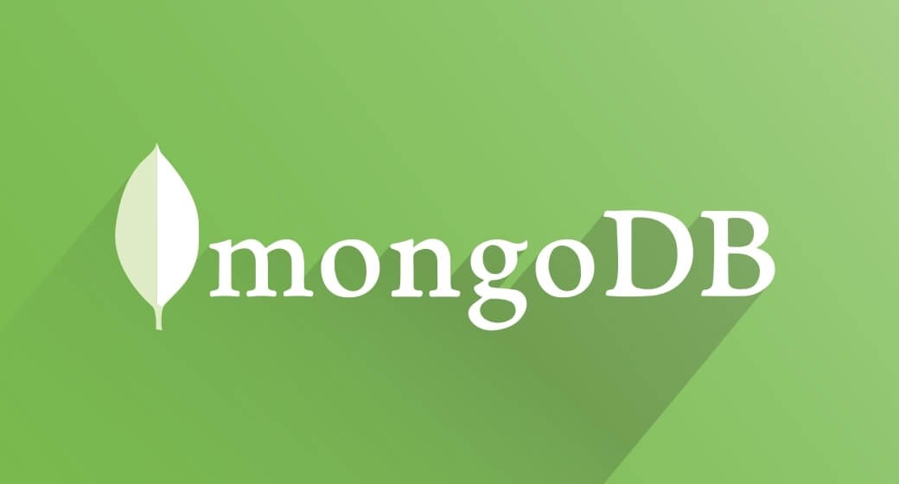
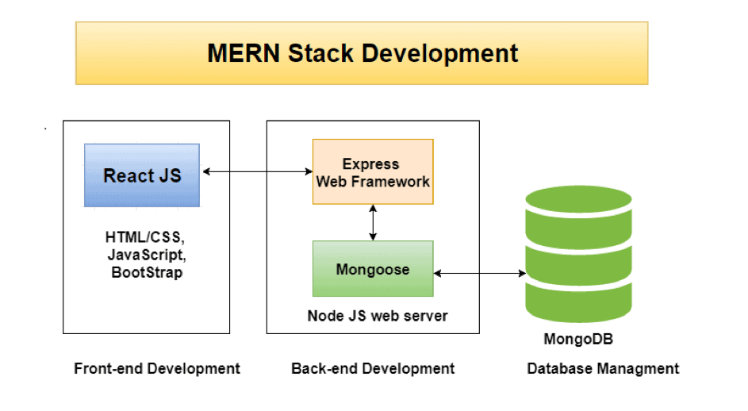

# 1/11/21 - MongoDB

**In yesterday's lesson**, we:

- Created schemas for MySQL (such as "create table")
- Performed **CRUD** operations in MySQL (such as INSERT, SELECT, UPDATE, and DELETE)
- Discussed some differences between a relational database and a document-based database


... but even more than that, we did some **pattern matching.** :crystal_ball: Take this SQL example...


```sql
/* if we know that this line of code gets all rows from the Ingredient table with SQL... */

SELECT * FROM Ingredient

/* ... and we need to get all rows from the Measure table, we can pattern match... */

SELECT * FROM Measure
```


**In today's lesson**, we're going to create a recipe/ingredients database with MongoDB similar to the SQL database from before.  




**But first!** Where are we in our journey?



**Curious about the Capstone?**  Check out this full stack MERN project tutorial, it's very similar!

https://www.freecodecamp.org/news/deploying-a-mern-application-using-mongodb-atlas-to-heroku/


### Agenda


1. SQL Lab Q&A
2. Live Coding Mongo
   1. Database -> Collection -> Document
   2. https://docs.mongodb.com/manual/crud/
   3. https://mongoplayground.net/
3. Deeper in to Mongo
   1. 3 advantages and 3 disadvantages each for SQL vs. NoSQL
   2. Discuss sharding
   3. Discuss how Mongo doesn't have a schema, but Mongoose does
   4. Discuss the model
4. Work on Lab #2


### Assignment for Today (due at midnight tonight)

[U2 Lab 2: Exploring a MongoDB database](https://skilledkc.valor.training/mod/assign/view.php?id=11657)

In this assignment, we'll create a recipe database - this time in Mongo instead of SQL.  Please follow these instructions instead of the instructions listed in the assignment:

1. This lab is going to be relatively simple, since this is all new. We're going to create a recipe ingredients database with Mongoose similar to the SQL database from before.
2. Create the mongoose schema and model
7. Insert 3 new recipes and their ingredients, amounts, and measures in to the Database
8. Write a query to get a list of all the Recipes
9. Write a query to get a list of Recipes that use a certain Ingredient
10. Write a query to update a recipe you added
7. Comment the code and clearly explain what the script is doing.
8. Put your  commands in a file in a Github repo and submit the repo link to Lab 2

